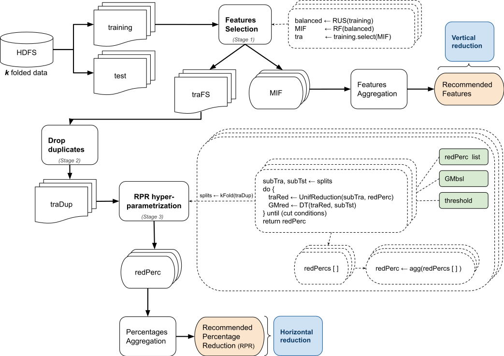

# big_data_reduction_recommender
FDR2-BD: A Fast Data Reduction Recommendation Tool for Tabular Big Data Classification Problems

FDR2 -BD is a methodological data condensation approach for reducing tabular big datasets in classification problems. The key of our proposal is to analyze data in a dual way (vertical and horizontal), so as to provide a smart combination between feature selection to generate dense clusters of data and uniform sampling reduction to keep only a few representative samples from each problem area. Its main advantage is allowing the model’s predictive quality to be kept in a range determined by a user’s threshold. Its robustness is built on a hyper-parametrization process, in which all data are taken into consideration by following a k-fold procedure. Another significant capability is being fast and scalable by using fully optimized parallel operations provided by Apache Spark.

For further information, please refer to related article: https://www.mdpi.com/2079-9292/10/15/1757

## Please, cite this software as:
Basgall, M.J.; Naiouf, M.; Fernández, A. FDR2-BD: A Fast Data Reduction Recommendation Tool for Tabular Big Data Classification Problems. Electronics 2021, 10, 1757. https://doi.org/10.3390/electronics10151757

### Bibtex:
@Article{electronics10151757,
	AUTHOR = {Basgall, María José and Naiouf, Marcelo and Fernández, Alberto},
	TITLE = {FDR2-BD: A Fast Data Reduction Recommendation Tool for Tabular Big Data Classification Problems},
	JOURNAL = {Electronics},
	VOLUME = {10},
	YEAR = {2021},
	NUMBER = {15},
	ARTICLE-NUMBER = {1757},
	URL = {https://www.mdpi.com/2079-9292/10/15/1757},
	ISSN = {2079-9292},
	DOI = {10.3390/electronics10151757}
}
